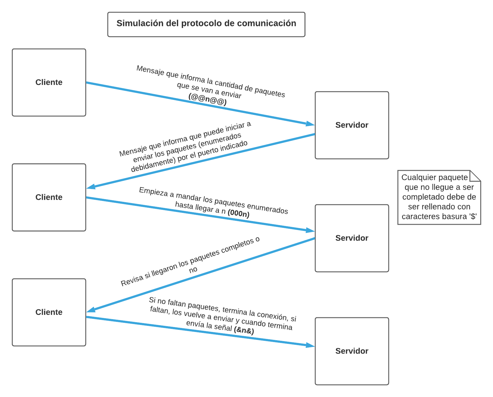

# Diseño Primera Entrega PI

## Diseño de la primera entrega general

Para empezar la comunicación servidor-cliente y servidor-impresora es por medio del protocolo UDP. Este protocolo va a enviar paquetes de 1024 bytes, donde, los cuatro primeros bytes son de control y 1020 bytes son destinados para el mensaje.

Los archivos enviados por el cliente son documentos ***.csv***, en los cuales, va a estar almacenada la información de cada paciente.

Inicialmente se tenía el siguiente diseño:

Dentro de la impresora iban a existir dos procesos que se van a comunicar por medio de un *pipe*. El proceso *padre* va recibir los datos del servidor y de escribirlos dentro de un *pipe*; y el proceso *hijo* va a leer la información que fue almacenada dentro del *pipe* e imprimirla en la consola.

Sin embargo, después de discutir el diseño con los profesores y compañeros, se llegó a la conclusión de que sería mejor que el servidor principal simplemente tuviera dos procesos: uno para imprimir y otro para recibir la información. Por esta razón, el diseño para esta entrega queda así:

### Diseño del pipe

El *pipe* es la estructura que se va a utilizar para la comunicación entre procesos. En la siguiente imagen se muestra como va a funcionar este *pipe*.

## Protocolo de comunicación TCP

El protocolo de comunicación fue decidido con todos los compañeros del curso, así como su formato, el cual se detalla a continuación:

## Etapas

1. El cliente envía un mensaje que contiene la cantidad de paquetes necesarios para enviar el mensaje, en el siguiente formato: @@N@@.
2. El servidor le informa al cliente que puede enviar los paquetes mediente un mensaje donde le envía el nuevo puerto al cual se tiene que comunicar el cliente.
3. El cliente empieza a mandar los paquetes usando los debidos encabezados para cada uno, hasta llegar al encabezado N. Formato del encabezado: 000N.
4. El servidor revisa los paquetes e informa si el mensaje está incompleto.
5. Si no faltan paquetes, termina la conexión, si faltan, el cliente vuelve a enviarlos y cuando termina se envía la señal de finalización (&&N&&).
